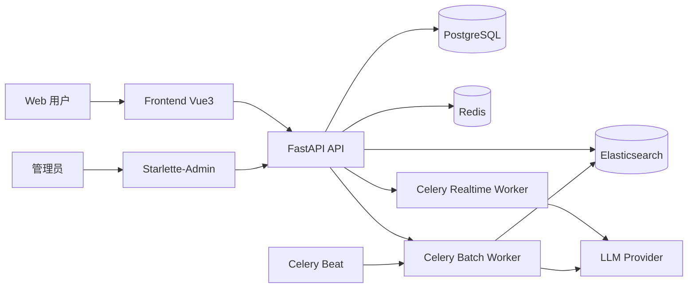
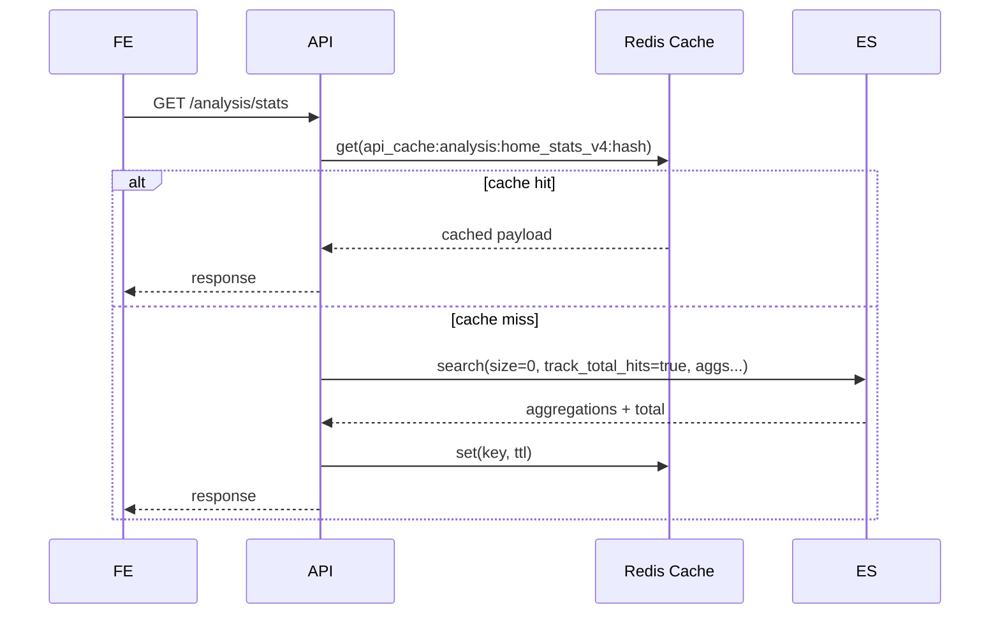
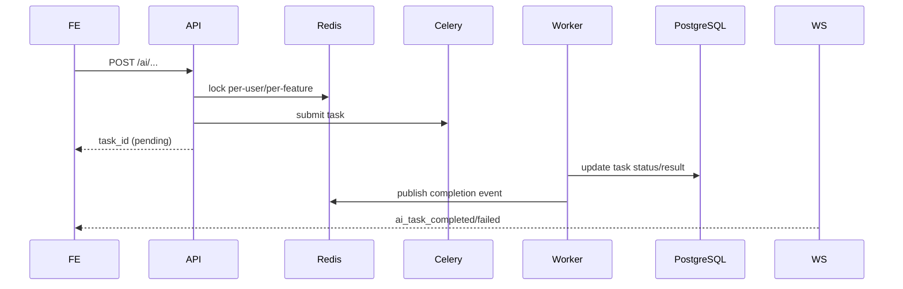
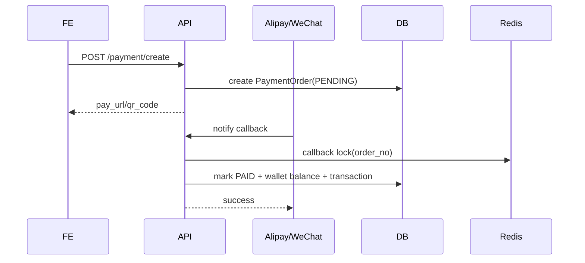
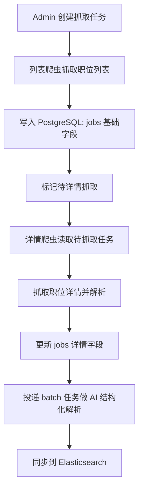
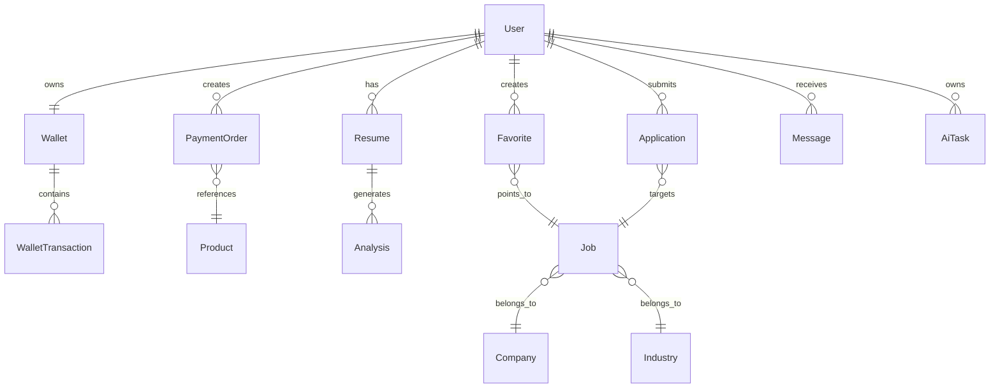
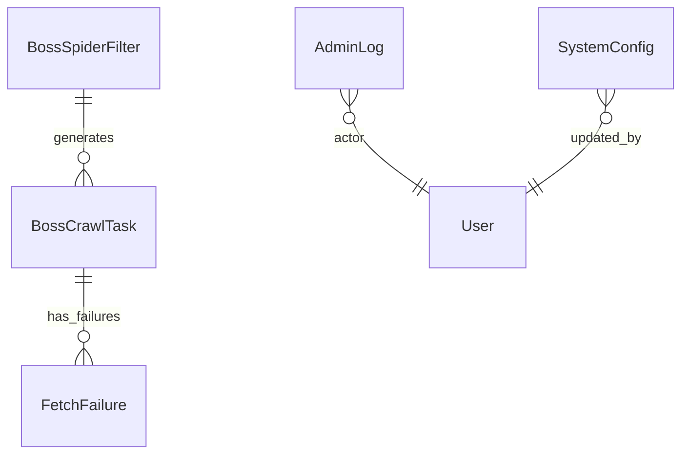

# ARCHITECTURE

## 1. 文档目标

本文件描述当前系统的核心架构、关键链路、扩展策略与运行约束，用于开发、排障和部署协作。

## 2. 系统上下文（Context）

## 3. 容器与模块（Container / Module）

### 3.1 前端

- 路径：`frontend/`
- 核心：Vue3 + Pinia + Axios + ECharts
- 角色：页面渲染、任务轮询、WebSocket 通知消费

### 3.2 API 服务

- 路径：`jobCollectionWebApi/`
- 分层：
  - `api/v1/endpoints`: 路由层（鉴权、参数、响应）
  - `services`: 业务编排（ES/AI/缓存）
  - `crud`: 数据访问
  - `tasks`: Celery 任务
  - `core`: 缓存、日志、鉴权、异常、指标

### 3.3 数据基础设施

- PostgreSQL：主业务数据
- Elasticsearch：职位检索与聚合
- Redis：缓存、分布式锁、Pub/Sub、队列中间件

### 3.4 异步系统

- Realtime 队列：面向用户交互的 AI 任务
- Batch 队列：离线解析、同步、定时任务

## 4. 关键时序（Runtime Sequence）

### 4.1 首页统计（`/api/v1/analysis/stats` 无筛选）

架构约束：

- 聚合统计必须启用 `track_total_hits=true`，避免总量被 10000 截断。
- 缓存命中判断必须使用 `cached_data is not None`。
- 缓存键必须覆盖位置参数和关键字参数（统一绑定后哈希）。

### 4.2 AI 任务（提交 -> 执行 -> 通知）

### 4.3 支付（创建 -> 回调 -> 钱包入账）

架构约束：

- 回调处理必须幂等（订单锁 + 状态二次校验）。
- `PAYMENT_NOTIFY_BASE_URL` 只配到 `/notify`，渠道后缀由代码拼接。
- `ALIPAY_APP_AUTH_TOKEN` 仅 ISV 模式填写；直连商户保持为空。

## 5. 数据架构

核心领域模型：

- 用户域：`User`, `Wallet`, `WalletTransaction`
- 职位域：`Job`, `Company`, `Industry`, `Skill`
- AI 域：`AiTask`, `Analysis`, `Message`
- 支付域：`PaymentOrder`, `Product`
- 运营域：`AdminLog`, `SystemConfig`

设计原则：

- 高频查询优先索引化和分页化。
- count 查询必须在 DB 侧执行（`COUNT(*)`），禁止“全量拉取后 len()”。

## 6. 可观测性与运维

- 日志：`jobCollectionWebApi/logs/*.log`
- 指标：Prometheus 抓取 `/metrics`
- 看板：Grafana
- 重点监控项：
  - API 延迟与错误率
  - Redis 连接健康与缓存命中率
  - Celery 队列堆积与任务耗时
  - ES 查询延迟与失败率

## 7. 部署拓扑（腾讯云轻量服务器建议）

最小单机生产拓扑：

- `Nginx`（80/443）
- `FastAPI`（uvicorn 多 worker）
- `Celery worker realtime`
- `Celery worker batch`
- `Celery beat`
- `PostgreSQL`
- `Redis`
- `Elasticsearch`（可外置）

进程托管建议：`Supervisor`

## 8. 扩展策略

1. 读扩展：优先将搜索与统计流量压到 ES，核心事务保留 PG。  
2. 写扩展：支付与 AI 回调走异步化与幂等锁，降低峰值冲突。  
3. 任务扩展：按队列水平扩容 worker，实时任务与批处理物理隔离。  
4. 缓存扩展：热点接口统一使用 `@cache + lock + jitter`。  

## 9. 近期架构变更（2026-03-07）

1. 首页统计总量修复：ES 聚合全面启用 `track_total_hits=true`。  
2. 缓存层修复：`core/cache.py` 支持位置参数绑定、`is not None` 命中判断、命中日志。  
3. 公司查询优化：同条件 `count_search`，并修复通用 `CRUDBase.count`。  
4. 支付配置增强：支持可选 `ALIPAY_APP_AUTH_TOKEN`，统一 notify URL 拼接规则。  

## 10. 爬虫与采集架构（补充）

### 10.1 组件

- 列表采集：`jobCollection/spiders/boss_list_drission_spider.py`
- 详情采集：`jobCollection/spiders/boss_detail_drission_spider.py`
- 任务管理：`common/databases/models/boss_crawl_task.py`
- 失败重试：`common/databases/models/fetch_failure.py`
- 管控入口：`jobCollectionWebApi/admin/views/crawler.py`

### 10.2 流程

### 10.3 设计要点

- 抓取任务与业务数据解耦，任务状态独立可追踪。  
- 失败任务有独立记录，便于重试与质量统计。  
- 详情抓取与 AI 解析分阶段，降低单链路阻塞。  

## 11. 数据库 ER 关系（补充）

### 11.1 主体 ER 图

### 11.2 爬虫与运营侧模型关系

### 11.3 关键表与职责

- 用户域：`users`, `wallets`, `wallet_transactions`
- 交易域：`payment_orders`, `products`
- 职位域：`jobs`, `company`, `industries`
- AI 域：`ai_tasks`, `analysis`
- 内容域：`messages`, `favorites`, `applications`
- 爬虫域：`boss_crawl_tasks`, `boss_spider_filters`, `fetch_failures`
- 运营域：`admin_logs`, `system_config`

## 12. 索引与查询约束（补充）

- 统计/列表接口必须分页，避免全表扫描。  
- 计数必须走 DB `COUNT(*)`，禁止全量加载后计算长度。  
- ES 统计查询必须 `size=0` 且 `track_total_hits=true`。  
- 支付回调必须基于 `order_no` 幂等处理（锁 + 状态复核）。  
