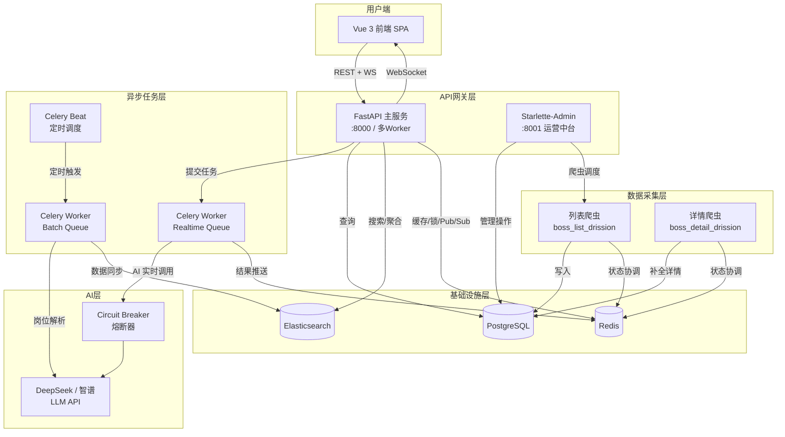
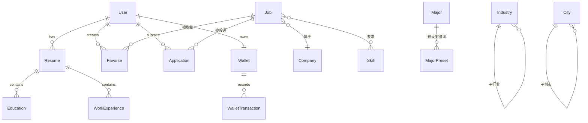

# 项目架构设计文档

> 招聘数据采集与智能分析平台 · 全栈架构蓝图

---

## 一、系统全局架构



---

## 二、技术栈矩阵

| 层级 | 技术 | 用途 |
|------|------|------|
| **前端** | Vue 3 + Vite | SPA 单页应用 |
| | ECharts + echarts-wordcloud | BI 可视化图表 |
| | Element Plus | UI 组件库 |
| | Axios (双拦截器) | HTTP 客户端 + 无感刷新 |
| **后端** | FastAPI + Uvicorn (多Worker) | 异步HTTP服务 |
| | Starlette-Admin | 独立运营后台 |
| | SQLAlchemy 2.0 + asyncpg | 异步ORM |
| | Pydantic v2 | 数据校验 |
| | Loguru | 全链路日志 |
| **任务** | Celery (realtime / batch) | 异步任务队列 |
| | Celery Beat | 定时调度 |
| **搜索** | Elasticsearch | 全文搜索 + 聚合分析 |
| **缓存** | Redis | 缓存 / 分布式锁 / Pub/Sub / WS |
| **AI** | LangChain + OpenAI协议 | LLM 调用 |
| | Circuit Breaker | 熔断保护 |
| **爬虫** | DrissionPage (Chromium) | 浏览器自动化 |
| | Scrapy | 爬虫框架 |
| | mitmproxy | 拦截代理 |
| **支付** | 支付宝 / 微信 | 充值体系 |

---

## 三、后端服务分层架构

```
jobCollectionWebApi/
├── api/v1/endpoints/       ← Controller 层 (路由 + 参数校验)
├── services/               ← Service 层   (业务逻辑)
├── crud/                   ← Repository 层 (数据库操作)
├── core/                   ← 核心基础设施  (安全/缓存/日志/熔断)
├── tasks/                  ← Celery 任务层 (异步后台处理)
├── schemas/                ← DTO 层        (Pydantic 模型)
├── middleware/             ← 中间件层      (日志/响应包装)
├── admin/                  ← 运营后台      (独立Admin服务)
└── scripts/                ← 运维脚本      (ES初始化/数据迁移)
```

### 3.1 API Controller 层 (16 个端点)

| Controller | 路由前缀 | 核心功能 |
|------------|----------|----------|
| `auth_controller` | `/auth` | 登录/注册/刷新Token/发短信 |
| `user_controller` | `/users` | 用户信息CRUD |
| `job_controller` | `/jobs` | 职位列表/搜索/AI语义搜索 |
| `company_controller` | `/companies` | 公司信息查询 |
| `analysis_controller` | `/analysis` | 数据大盘/技能词云/AI职业建议/职业罗盘 |
| `resume_controller` | `/resumes` | 简历CRUD/AI解析上传 |
| `favorite_controller` | `/favorites` | 职位收藏 |
| `application_controller` | `/applications` | 投递记录 |
| `payment_controller` | `/payments` | 支付宝/微信充值/回调 |
| `wallet_controller` | `/wallet` | 钱包余额/流水 |
| `message_controller` | `/messages` | 系统消息 |
| `upload_controller` | `/upload` | 文件上传 (OSS) |
| `skill_controller` | `/skills` | 技能标签 |
| `city_controller` | `/cities` | 城市数据 |
| `industry_controller` | `/industries` | 行业树/级联 |
| `ws_controller` | `/ws` | WebSocket 实时通信 |

### 3.2 Service 层 (9 个服务)

| Service | 职责 |
|---------|------|
| `ai_service` | LLM 调用封装 (LangChain + 原生HTTP), 熔断器集成, 结果缓存 |
| `ai_access_service` | AI 功能计费: 速率限制 + 余额检查 + 扣费 |
| `analysis_service` | ES 聚合查询: 薪资/行业/技能统计, 支持行业穿透 |
| `search_service` | ES 全文搜索 + AI 意图搜索 DSL 组装 |
| `auth_service` | JWT 颁发/刷新/黑名单, OAuth集成 |
| `crawler_service` | 爬虫进程管理: 启动/暂停/停止 subprocess |
| `proxy_service` | 代理池管理: KDL API 拉取 + 可用性检测 |
| `sms_service` | 短信验证码 (阿里云) |
| `wechat_service` | 微信支付/登录 |

### 3.3 Core 基础设施 (7 个模块)

| 模块 | 功能 |
|------|------|
| `celery_app` | Celery 实例 + 双队列路由 (realtime / batch) |
| `celery_events` | 任务信号监听器 → TaskLog 自动记录 |
| `circuit_breaker` | AI 熔断器 (CLOSED→OPEN→HALF_OPEN) |
| `cache` | `@cache` 装饰器 + 分布式锁 `cache_lock` |
| `security` | JWT 编解码 + Token 黑名单 |
| `logger` | Loguru 全局接管 (Uvicorn/Celery/App 分流落盘) |
| `status_code` | 统一状态码枚举 |

### 3.4 Celery 任务层 (5 个任务模块)

| 任务 | 队列 | 功能 |
|------|------|------|
| `ai_tasks.career_advice_task` | realtime | AI 职业建议生成 + 扣费 + WS推送 |
| `ai_tasks.career_compass_task` | realtime | AI 罗盘报告生成 + 扣费 + WS推送 |
| `ai_tasks.ai_search_task` | realtime | AI 意图解析 + ES搜索 + 缓存 |
| `resume_parser.parse_resume_task` | realtime | PDF简历 AI 解析 → 结构化数据 |
| `job_parser.batch_parse_jobs_task` | batch | 批量岗位 LLM 标签提取 (Semaphore 3并发) |
| `es_sync.sync_jobs_to_es_task` | batch | PostgreSQL → Elasticsearch 增量同步 |
| `proxy_tasks.refresh_proxy_pool` | batch | 代理池定时刷新 |

---

## 四、数据模型架构



### 核心实体 (29 个模型)

| 领域 | 模型 | 说明 |
|------|------|------|
| **用户** | `User`, `Wallet`, `WalletTransaction` | 用户 + 钱包 + 流水 |
| **岗位** | `Job`, `Company`, `Skill` | 职位 + 公司 + 技能标签 |
| **简历** | `Resume`, `Education`, `WorkExperience` | 结构化简历 |
| **互动** | `Favorite`, `Application`, `Message` | 收藏 + 投递 + 消息 |
| **支付** | `PaymentOrder`, `Product` | 充值订单 + 商品 |
| **地理** | `City`, `CityHot`, `Industry` | 城市 + 热门城市 + 行业树 |
| **教育** | `Major`, `MajorPreset`, `School` | 专业 + 预设 + 院校 |
| **爬虫** | `BossCrawlTask`, `BossSpiderFilter`, `FetchFailure` | 任务 + 过滤 + 失败记录 |
| **系统** | `AdminLog`, `TaskLog`, `Proxy`, `SystemConfig` | 审计 + 任务日志 + 代理 + 配置 |

---

## 五、数据采集架构

```
┌──────────────────────────────────────────────────┐
│                Admin 运营中台                      │
│   [创建任务] → [启动] → [暂停] → [停止]           │
└────────────┬─────────────────────────────────────┘
             │ subprocess 启动
             ▼
┌──────────────────────────────────────────────────┐
│         boss_list_drission_spider                 │
│                                                   │
│  DrissionPage (Chromium) + 代理池                  │
│  ① 浏览岗位列表 → ② 提取基础信息 → ③ 写入 PG     │
│  ④ 标记 is_crawl=0 (待详情采集)                   │
└────────────┬─────────────────────────────────────┘
             │ Redis 队列协调
             ▼
┌──────────────────────────────────────────────────┐
│         boss_detail_drission_spider               │
│                                                   │
│  ① 领取任务 → ② 立即标记 is_crawl=2 (防重复)     │
│  ③ 浏览器导航详情页 → ④ mitmproxy 拦截响应       │
│  ⑤ 解析职位描述/要求 → ⑥ 更新 PG (is_crawl=1)   │
│  ⑦ 60s 超时保护 + 脏数据隔离                     │
└────────────┬─────────────────────────────────────┘
             │ Celery Beat 定时触发
             ▼
┌──────────────────────────────────────────────────┐
│         batch_parse_jobs_task (Celery)             │
│                                                   │
│  ① 拉取未解析岗位 → ② 预锁定 ai_parsed=1        │
│  ③ Semaphore(3) 并发 LLM 调用                    │
│  ④ 提取: 福利/技能/标签 → ⑤ 写回 PG              │
└──────────────────────────────────────────────────┘
```

---

## 六、前端功能模块

| 页面 | 组件 | 核心功能 |
|------|------|----------|
| **首页** | `HomeView.vue` | 平台入口 + 快速搜索 + 功能导航 |
| **职位集市** | `JobMarket.vue` | 筛选搜索 + AI语义搜索 + 详情预览 |
| **职位详情** | `JobDetail.vue` | 完整JD + 收藏/沟通 |
| **公司列表** | `CompanyList.vue` | 企业浏览 |
| **公司详情** | `CompanyDetail.vue` | 企业画像 |
| **职业罗盘** | `CareerCompass.vue` | 专业→行业级联 + ES统计图表 + AI报告 |
| **专业分析** | `MajorAnalysis.vue` | 技能TOP15 + 薪资分布 + AI建议 |
| **数据洞察** | `JobAnalysis.vue` | 宏观就业数据BI看板 |
| **我的简历** | `MyResume.vue` | 简历CRUD + PDF上传AI解析 |
| **我的收藏** | `MyFavorites.vue` | 收藏管理 |
| **投递记录** | `MyApplications.vue` | 投递追踪 |
| **消息中心** | `MessageCenter.vue` | 系统通知 |
| **钱包** | `WalletView.vue` | 余额/充值/流水 |
| **登录** | `LoginView.vue` | 认证入口 |

---

## 七、弹性与高可用架构

### 7.1 多层缓存防御体系

```
请求 → @cache 装饰器 (Controller 层, Hash Key + TTL 抖动)
         ↓ miss
       cache_lock 分布式锁 (防击穿)
         ↓ 获锁
       Service 层 AI 结果缓存 (24h / 12h)
         ↓ miss
       Elasticsearch / PostgreSQL 查询
         ↓
       写入缓存 (空结果短缓存, 防穿透)
```

### 7.2 AI 熔断器

```
正常 (CLOSED) ──5次连续失败──→ 熔断 (OPEN) ──60s冷却──→ 半开 (HALF_OPEN)
     ↑                                                        │
     └──────────────── 探测成功 ──────────────────────────────┘
                       探测失败 → 回到 OPEN
```

### 7.3 Celery 队列隔离

```
┌─────────────────────────────────────────────┐
│ Realtime Queue (用户实时)                     │
│ ├── career_advice_task                       │
│ ├── career_compass_task                      │
│ ├── ai_search_task                           │
│ └── parse_resume_task                        │
├─────────────────────────────────────────────┤
│ Batch Queue (后台批量)                        │
│ ├── batch_parse_jobs_task                    │
│ ├── sync_jobs_to_es_task                     │
│ └── refresh_proxy_pool                       │
└─────────────────────────────────────────────┘
     物理隔离: 两个独立 Worker 进程
```

---

## 八、部署架构

```bash
# FastAPI 服务
run_api_dev.bat       # 开发: 单 Worker + 热重载
run_api_prod.bat      # 生产: 4 Worker + 0.0.0.0

# Celery 双队列
run_worker.bat            # batch 队列 Worker
run_worker_realtime.bat   # realtime 队列 Worker
run_beat.bat              # 定时任务调度器

# Admin 后台
python main_admin.py      # 独立端口 :8001
```

### 端口分配

| 服务 | 端口 | 说明 |
|------|------|------|
| FastAPI 主服务 | 8000 | RESTful API + WebSocket |
| Admin 运营中台 | 8001 | Starlette-Admin |
| PostgreSQL | 5432 | 主数据库 |
| Redis | 6379 | 缓存/队列/锁/Pub-Sub |
| Elasticsearch | 9200 | 搜索引擎 |
| Vite Dev Server | 5173 | 前端开发 |

---

## 九、认证与计费体系

### 9.1 JWT 双Token 认证流

```
登录 → Access Token (2h) + Refresh Token (90d)
         ↓ 过期
Axios 拦截器 → 静默刷新 → 队列缓冲 → 重发原请求
         ↓ 刷新失败
强制登出 → 清除本地存储 → 跳转登录页
```

### 9.2 AI 功能计费流

```
Controller: ensure_access(user, feature)
  ├── 检查功能策略 (免费额度/付费)
  ├── 速率限制 (Redis 滑动窗口)
  └── 余额预检
          ↓ 通过
提交 Celery 任务 → AI 调用成功
          ↓
charge_usage(user, feature, amount)
  └── Wallet 余额扣减 + 流水记录
```
