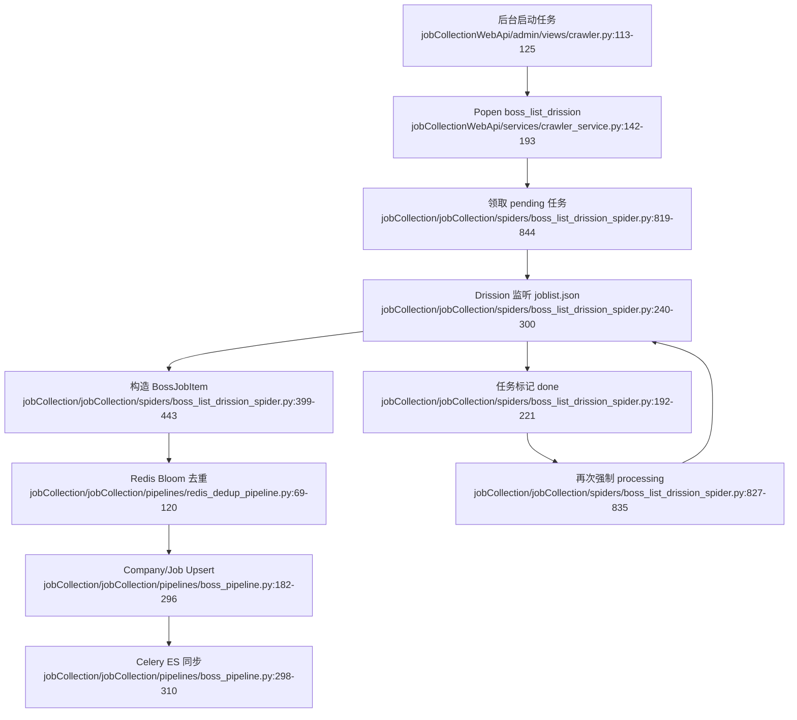

# 后台现役 BOSS 列表采集

```mermaid
flowchart TD
    A["后台启动任务<br/>jobCollectionWebApi/admin/views/crawler.py:113-125"]
    B["Popen boss_list_drission<br/>jobCollectionWebApi/services/crawler_service.py:142-193"]
    C["领取 pending 任务<br/>jobCollection/jobCollection/spiders/boss_list_drission_spider.py:819-844"]
    D["Drission 监听 joblist.json<br/>jobCollection/jobCollection/spiders/boss_list_drission_spider.py:240-300"]
    E["构造 BossJobItem<br/>jobCollection/jobCollection/spiders/boss_list_drission_spider.py:399-443"]
    F["Redis Bloom 去重<br/>jobCollection/jobCollection/pipelines/redis_dedup_pipeline.py:69-120"]
    G["Company/Job Upsert<br/>jobCollection/jobCollection/pipelines/boss_pipeline.py:182-296"]
    H["Celery ES 同步<br/>jobCollection/jobCollection/pipelines/boss_pipeline.py:298-310"]
    I["任务标记 done<br/>jobCollection/jobCollection/spiders/boss_list_drission_spider.py:192-221"]
    J["再次强制 processing<br/>jobCollection/jobCollection/spiders/boss_list_drission_spider.py:827-835"]

    A --> B --> C --> D --> E --> F --> G --> H
    D --> I --> J --> D
```

外部依赖：PostgreSQL、Redis、Celery、Elasticsearch、Chromium、BOSS、KDL。

主要断点：成功任务会再次进入 `processing`；空 payload 也被判成功；任务 `done` 早于 Pipeline 完成。

