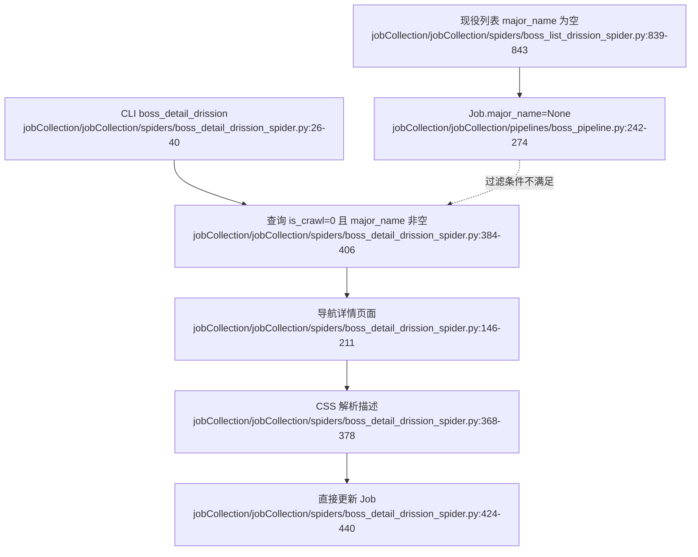

# BOSS 岗位详情补全

```mermaid
flowchart TD
    A["CLI boss_detail_drission<br/>jobCollection/jobCollection/spiders/boss_detail_drission_spider.py:26-40"]
    B["查询 is_crawl=0 且 major_name 非空<br/>jobCollection/jobCollection/spiders/boss_detail_drission_spider.py:384-406"]
    C["导航详情页面<br/>jobCollection/jobCollection/spiders/boss_detail_drission_spider.py:146-211"]
    D["CSS 解析描述<br/>jobCollection/jobCollection/spiders/boss_detail_drission_spider.py:368-378"]
    E["直接更新 Job<br/>jobCollection/jobCollection/spiders/boss_detail_drission_spider.py:424-440"]
    F["现役列表 major_name 为空<br/>jobCollection/jobCollection/spiders/boss_list_drission_spider.py:839-843"]
    G["Job.major_name=None<br/>jobCollection/jobCollection/pipelines/boss_pipeline.py:242-274"]

    A --> B --> C --> D --> E
    F --> G -. "过滤条件不满足" .-> B
```

外部依赖：PostgreSQL、Chromium、BOSS、KDL。

主要断点：未接入后台；失败和处理中都使用 `is_crawl=2`；直接 DB 更新绕过统一 Pipeline 与 ES 同步。

