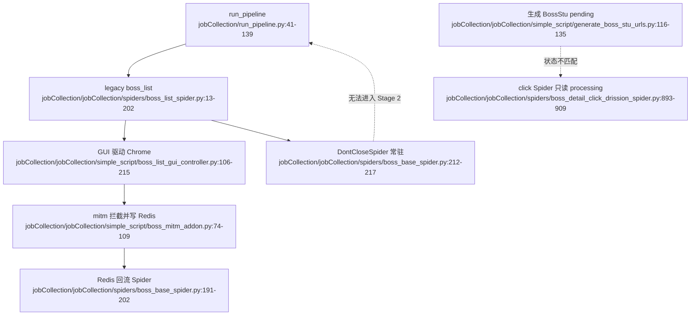

# Legacy 与实验路径

```mermaid
flowchart TD
    A["run_pipeline<br/>jobCollection/run_pipeline.py:41-139"]
    B["legacy boss_list<br/>jobCollection/jobCollection/spiders/boss_list_spider.py:13-202"]
    C["GUI 驱动 Chrome<br/>jobCollection/jobCollection/simple_script/boss_list_gui_controller.py:106-215"]
    D["mitm 拦截并写 Redis<br/>jobCollection/jobCollection/simple_script/boss_mitm_addon.py:74-109"]
    E["Redis 回流 Spider<br/>jobCollection/jobCollection/spiders/boss_base_spider.py:191-202"]
    F["DontCloseSpider 常驻<br/>jobCollection/jobCollection/spiders/boss_base_spider.py:212-217"]
    G["生成 BossStu pending<br/>jobCollection/jobCollection/simple_script/generate_boss_stu_urls.py:116-135"]
    H["click Spider 只读 processing<br/>jobCollection/jobCollection/spiders/boss_detail_click_drission_spider.py:893-909"]

    A --> B --> C --> D --> E
    B --> F -. "无法进入 Stage 2" .-> A
    G -. "状态不匹配" .-> H
```

外部依赖：桌面 Chrome、PyAutoGUI、mitmproxy、Redis、旧任务表、KDL。

结论：两条路径都没有可完成的仓内调度闭环，且与现役 Drission 实现大段重复。

