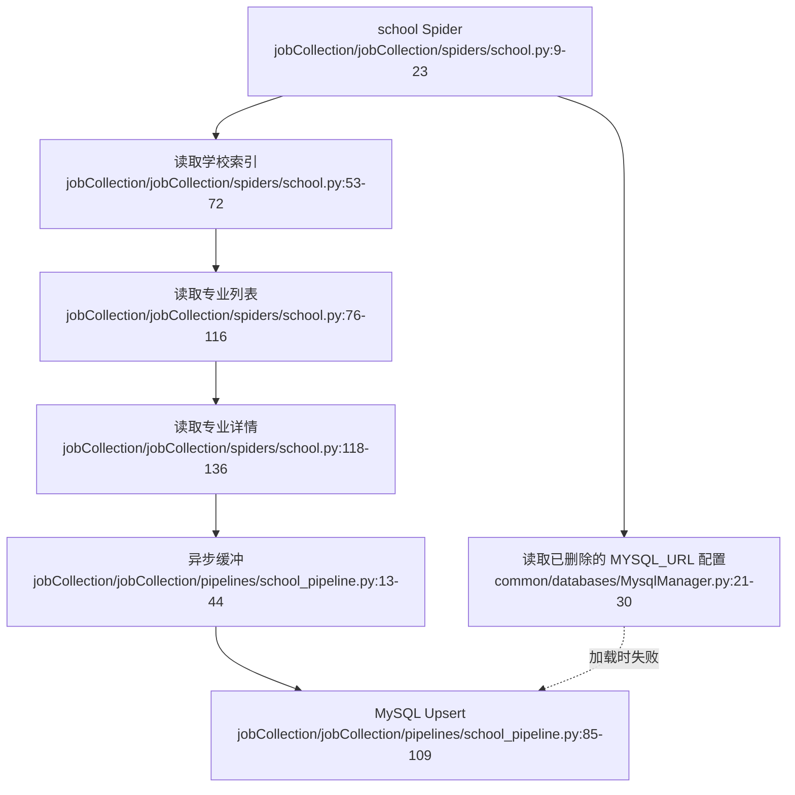

# 高考学校目录采集

```mermaid
flowchart TD
    A["school Spider<br/>jobCollection/jobCollection/spiders/school.py:9-23"]
    B["读取学校索引<br/>jobCollection/jobCollection/spiders/school.py:53-72"]
    C["读取专业列表<br/>jobCollection/jobCollection/spiders/school.py:76-116"]
    D["读取专业详情<br/>jobCollection/jobCollection/spiders/school.py:118-136"]
    E["异步缓冲<br/>jobCollection/jobCollection/pipelines/school_pipeline.py:13-44"]
    F["MySQL Upsert<br/>jobCollection/jobCollection/pipelines/school_pipeline.py:85-109"]
    G["读取已删除的 MYSQL_URL 配置<br/>common/databases/MysqlManager.py:21-30"]

    A --> B --> C --> D --> E --> F
    A --> G -. "加载时失败" .-> F
```

外部依赖：高考网、Scrapy、MySQL、PostgreSQL 失败日志。

主要断点：MySQL 配置已废弃；`major_job_map` 模块不存在；仓内无启动者。

