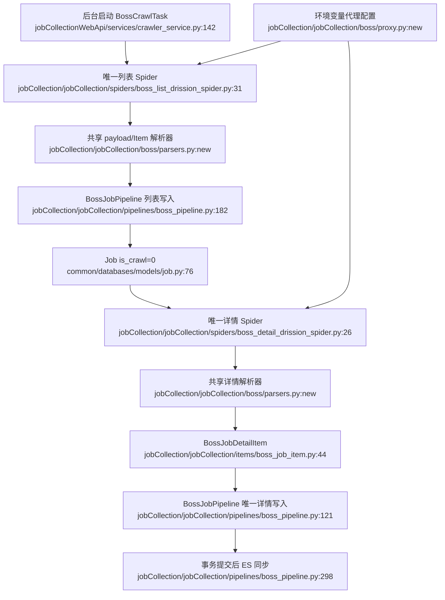

# 统一架构提案

## 目标组件

### 1. 单一 BOSS 列表 Spider

入口保留 `boss_list_drission`，由后台唯一启动。删除旧 `boss_list`、GUI、mitm 与 click 实验。Spider 只负责浏览器、任务和 payload 获取；纯函数负责 Item 映射。

### 2. 单一 BOSS 详情 Spider + 单一写入路径

入口保留 `boss_detail_drission`。移除 `major_name` 领取限制，使所有有效的 `is_crawl=0` Job 可补全。Spider 产生 `BossJobDetailItem`，`BossJobPipeline` 统一更新 PostgreSQL 并在提交后派发 ES。

### 3. 单一代理配置源

KDL 参数全部来自环境变量；源码不含 secret、账号或密码。两个现役 Spider 共享认证代理扩展生成工具，输出目录继续按 Spider/账号隔离。

### 4. 明确运行边界

删除无法运行且未被调度的学校 MySQL Spider、专业点击实验和运行时生成物。保留数据模型与 Web API 的学校业务读取能力，不把“删除采集器”扩大成“删除学校业务”。

## 旧调用点变化

| 旧位置 | 变化 |
|---|---|
| `crawler_service.py:170-175` | 继续启动 `boss_list_drission` |
| `run_pipeline.py:41-139` | 删除；不再作为第二入口 |
| `boss_detail_drission_spider.py:424-440` | 改为产出 `BossJobDetailItem` |
| `boss_pipeline.py:121-180` | 成为唯一详情写入口 |
| `proxy_manager.py:65-71` | 替换为环境变量配置 |
| `school.py:9-136` | 删除不可运行的孤立采集器 |

## 能力损失

- 移除通过真实桌面 GUI + mitmproxy 抓取的备用路径。该路径当前不能完成启动/调度闭环，损失可接受。
- 移除“专业×城市点击卡片抓详情”的实验路径。当前无启动者且任务状态断裂，损失可接受；列表与详情数据能力分别由两个现役 Spider 提供。
- 移除高考网到 MySQL 的旧采集器。当前配置已明确废弃且模块不能加载；学校业务模型和已有数据仍保留。

