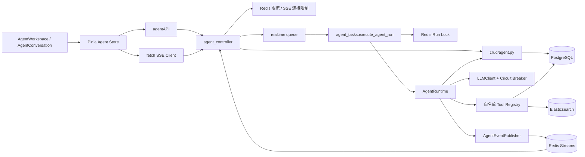
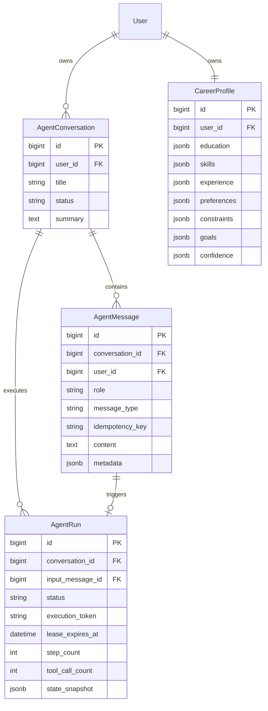
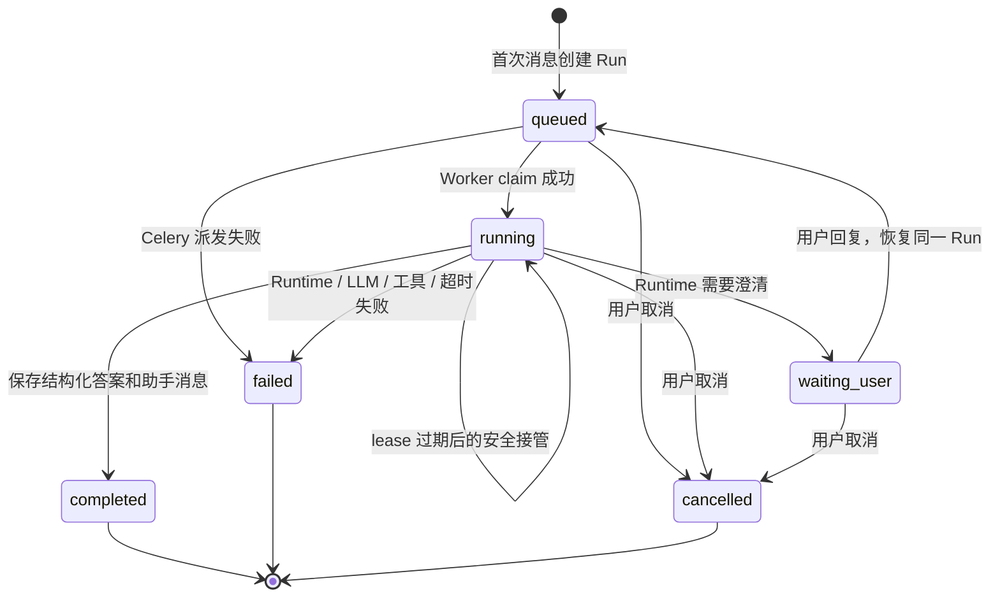
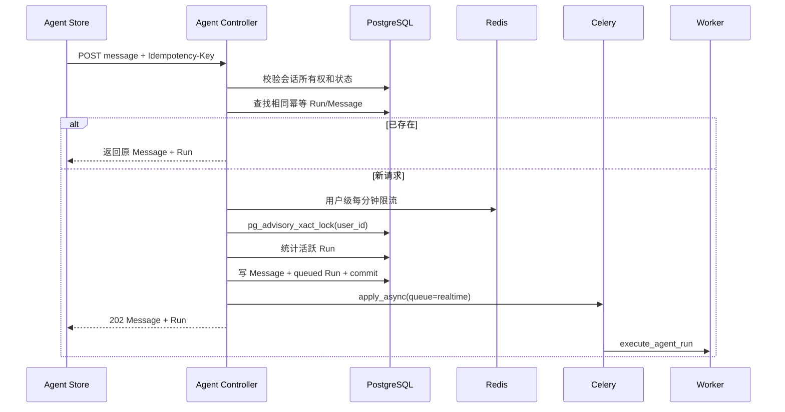
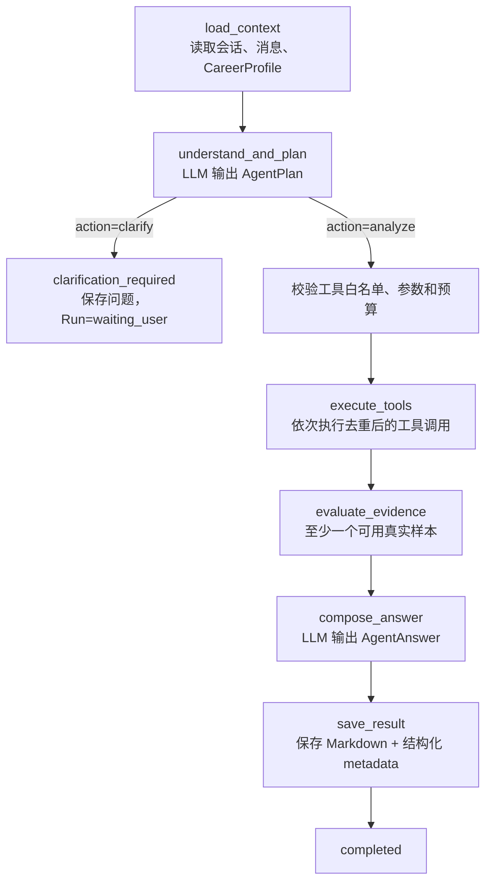
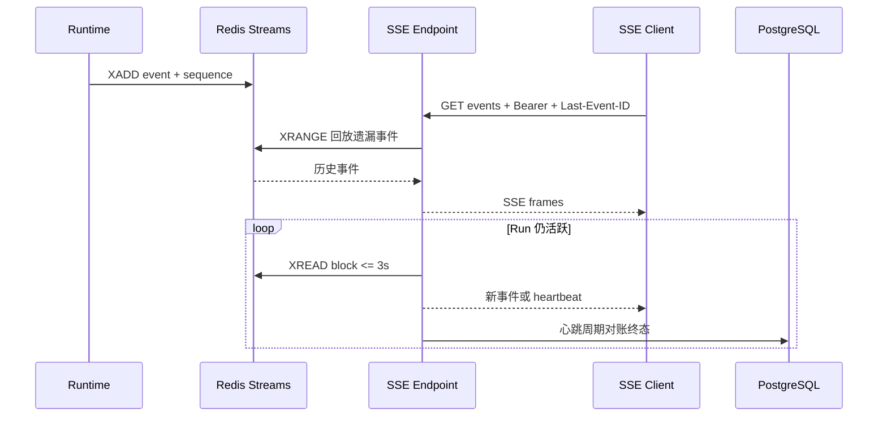

# Agent 架构与运行逻辑

> 适用代码基线：2026-07-28 工作区  
> 本文描述 `jobCollectionWebApi/agent/`、Agent API、Celery 任务以及前端 Agent Store 的当前真实实现。

## 1. 设计目标

职业规划 Agent 的核心原则是“LLM 负责规划和归纳，平台工具负责提供可验证事实”。它不是让模型直接生成 SQL/DSL，也不允许任意工具执行。每次用户消息对应一个有时间、步数、工具数和澄清次数上限的 `AgentRun`。

系统需要同时满足：

- 对话、消息、运行状态和职业画像可持久化。
- 重复提交不创建重复消息或运行。
- 同一用户默认只能有一个活跃运行。
- Worker 重试、进程丢失和网络断线后可以安全恢复。
- 前端能回放丢失事件，并以数据库状态兜底对账。
- 事件和结果不能泄漏 Prompt、Token、SQL/DSL 或完整内部状态。

## 2. 组件架构

## 3. 持久化模型

关键约束：

- Message 与 Run 都有 `(user_id, conversation_id, idempotency_key)` 唯一约束。
- Conversation、Message、Run 都通过 `user_id` 做所有权过滤，不能跨用户读取。
- Run 的 `execution_token + lease_expires_at` 用于数据库级执行权声明和过期接管。
- `state_snapshot` 保存 Runtime 检查点；Redis Streams 只保存临时实时事件，不是最终事实来源。
- 所有 Snowflake ID 在 API 层输出为字符串。

## 4. API 契约

所有路径均以 `/api/v1/agent` 为前缀。

| 方法与路径 | 用途 |
|---|---|
| `GET /capabilities` | 返回当前用户灰度可用性、SSE 支持和 dashboard 模式 |
| `POST /conversations` | 创建会话 |
| `GET /conversations` | 分页列出用户会话 |
| `GET /conversations/{id}` | 返回会话、最多 200 条消息和 latest_run |
| `PATCH /conversations/{id}` | 修改标题、归档状态或摘要 |
| `GET /conversations/{id}/messages` | 分页读取消息 |
| `POST /conversations/{id}/messages` | 提交用户消息并创建/恢复 Run；必须携带 `Idempotency-Key` |
| `GET /runs/{id}` | 获取数据库中的运行状态 |
| `GET /runs/{id}/events` | Bearer 鉴权 SSE；支持 `Last-Event-ID` |
| `POST /runs/{id}/cancel` | 取消 queued/running/waiting_user 运行 |
| `GET /profile` | 获取职业画像；不存在时创建空画像 |
| `PATCH /profile` | 更新用户确认的职业画像 |

接口在进入业务逻辑前验证登录用户、对象所有权和灰度开关。SSE 的鉴权使用短生命周期数据库会话，进入 StreamingResponse 前释放。

## 5. Run 状态机

活跃状态是 `queued`、`running`、`waiting_user`；终态是 `completed`、`failed`、`cancelled`。前端流式连接只在 `queued/running` 时保持，`waiting_user` 会暂停并等待用户输入。

## 6. 消息提交与派发

若 latest_run 为 `waiting_user`，用户回复不会创建新 Run，而是写入新用户消息，并把原 Run 从 `waiting_user` 原子迁移到 `queued` 后重新派发。

必须先提交数据库事务再派发 Worker，避免 Worker 看不到尚未提交的 Run。派发失败时，API 把 Run 改为 `failed` 并发布 `run_failed` 事件。

## 7. Worker 执行所有权

Worker 使用两层防重：

1. Redis `agent:run:{run_id}:lock`：减少多个 Worker 同时处理同一 Run；释放和续租通过 Token 校验的 Lua 脚本完成。
2. PostgreSQL `claim_run`：最终裁决。只有 `queued`，或 `running` 且 lease 已过期的记录能被原子 claim，并写入新的 `execution_token`。

若 Redis 临时不可用，任务记录告警并退化到数据库 claim；因此 Redis 锁是性能/竞争保护，数据库状态才是正确性边界。锁竞争时 Celery 每 5 秒重试，最多 20 次。

Celery 任务开启 `acks_late`、`reject_on_worker_lost`，软/硬时限分别为 65/75 秒。Runtime 默认自身运行预算为 60 秒。

## 8. Runtime 运行图

每个 `_checkpoint` 都会：

- 检查总截止时间、最大步骤和最大工具数。
- 原子确认 Run 仍为 `running` 且 execution_token 一致。
- 更新 `current_node`、计数和 `state_snapshot` 并提交。

若用户在执行中取消，下一检查点无法更新该 Run，Runtime 抛出取消异常并停止写结果。

默认预算来自配置：

| 预算 | 默认值 |
|---|---:|
| 单次 Run | 60 秒 |
| 单次 LLM | 20 秒 |
| 工具调用 | 6 次 |
| Runtime 步骤 | 12 步 |
| 澄清轮次 | 2 次 |
| LLM 输出 | 1200 tokens |
| 上下文消息 | 20 条 |

## 9. LLM 规划与回答

Runtime 对 LLM 进行两次结构化调用：

1. Planner：输入最近消息、已确认画像和工具 JSON Schema，输出 `AgentPlan`。Plan 必须选择 `clarify` 或 `analyze`；分析时至少包含一个工具。
2. Composer：输入最新用户问题、画像、意图和工具证据，输出 `AgentAnswer`，包含摘要、方向、技能差距、下一步行动、证据摘要和追问。

`LLMClient` 使用 LangChain `ChatOpenAI` 兼容接口和 Pydantic 输出解析器。生产环境拒绝 mock/无效 API Key；调用受 AI 熔断器、超时、一次模型重试和结构化校验保护。

## 10. 白名单工具

Runtime 只接受以下六个工具，名称同时存在于 `APPROVED_TOOL_NAMES` 和 Registry 才可执行。

| 工具 | 作用 | 数据源与降级 |
|---|---|---|
| `search_jobs` | 按关键词、城市、行业、技能、经验、学历、薪资搜索真实岗位 | Search Service；返回实际 source 和降级告警 |
| `get_market_overview` | 岗位量、薪资、技能、行业分布 | Elasticsearch；异常时降级 PostgreSQL |
| `get_skill_demand` | 高频技能和覆盖率 | 复用 market overview，继承其数据源 |
| `get_major_directions` | 专业到行业方向的数据库映射 | PostgreSQL；当前不做模型推断 |
| `compare_cities` | 两城市岗位、薪资、技能对比 | Elasticsearch；当前不支持 PG 降级 |
| `compare_industries` | 两行业岗位、薪资、技能对比 | Elasticsearch；当前不支持 PG 降级 |

工具输入先经过 Pydantic 校验，再受单工具 8 秒超时保护。工具异常被转换为受控 `ToolResult.failure`，不会把栈、SQL 或内部实现交给模型或前端。

工具结果包含 `ok`、`sample_size`、`filters`、`source`、`data_as_of`、`warnings` 和 `error_code`。Runtime 只有在至少一个结果成功、样本数大于 0 且数据非空时才进入答案合成。

## 11. 事件与 SSE

事件类型：

- `run_started`
- `plan_created`
- `tool_started`、`tool_progress`、`tool_completed`
- `clarification_required`
- `message_completed`
- `run_completed`、`run_failed`、`run_cancelled`

Redis Streams 使用两个键：

- `agent:run:{run_id}:events`
- `agent:run:{run_id}:event_sequence`

Lua 脚本原子递增 sequence 并 XADD；默认最多约 500 条，TTL 86400 秒。事件数据在写入前限制深度、数量和字符串长度，并屏蔽 `prompt`、`sql`、`dsl`、`api_key`、`token`、`traceback`、`state_snapshot`。

流在 `clarification_required` 或任一终态事件后关闭。若 Redis 中缺少终态事件，SSE 心跳会读取 PostgreSQL，并生成 `event_id=0-0` 的 reconciliation 事件结束连接。

每个用户默认最多两个 SSE 连接，使用 Redis 有序集合维护带过期时间的连接 Token。SSE 使用独立 Redis 连接池，默认最多 100 个连接，避免长轮询占满通用 Redis 池。

## 12. 前端恢复逻辑

Pinia Agent Store 保存会话、消息、activeRun、事件、结构化结果、连接状态和最后事件 ID。

连接流程：

1. 打开会话后读取 latest_run；仅 queued/running 自动连接 SSE。
2. SSE 首次 401 时复用统一 Token 刷新逻辑，使用新 Token 重试一次。
3. 每个 Redis event ID 被记录到 `Last-Event-ID`；重复事件按 run/event ID/type 去重。
4. 非终态断线按约 1、2、4、8、15 秒指数退避并加 0–350ms 抖动。
5. 每次退避后先 `GET /runs/{id}` 对账；仍活跃才重连。
6. 五次后改为每 15 秒数据库恢复检查。
7. `waiting_user` 进入 `paused`；终态进入 `closed`，不再重连，并刷新会话快照。

连接和会话请求都使用 generation 防竞态：旧流事件、旧的会话打开响应、以及旧会话终态快照都不能覆盖用户后来打开的新会话。

前端只持久化方向选择、周行动完成项和收藏机会等非敏感 dashboard 状态；登出/reset 会中止流、清空会话/消息/画像/上传信息并删除持久化 Store。

## 13. 灰度、失败和可观测性

灰度顺序：

1. `AGENT_ENABLED` 总开关必须开启。
2. `AGENT_ROLLOUT_USER_IDS` 中的用户直接放行。
3. 其余用户按 user_id 的稳定 SHA-256 bucket 与 `AGENT_ROLLOUT_PERCENT` 比较。
4. 前端以 `/capabilities.enabled` 作为运行时最终功能门。

关键失败策略：

- Redis 用户限流不可用：API 返回 503，不在无保护状态下继续创建 Run。
- Redis Run Lock 不可用：记录告警，依赖数据库 claim 保证正确性。
- 事件发布失败：运行继续，前端通过 Run 状态/SSE reconciliation 恢复。
- LLM 配置、超时、熔断、结构化输出失败：Worker 将 Run 原子迁移为 failed。
- Celery 派发失败：API 立即落库 failed，并发布失败事件。
- 用户取消：状态原子迁移，后续 Runtime checkpoint 会停止执行。

Prometheus 指标覆盖 Run 创建/完成/失败/取消、耗时、首事件延迟、工具调用/失败、活跃 SSE、SSE 重连、锁竞争和事件发布失败。

## 14. 当前产品边界

- 对话、运行、工具证据、结构化 Agent 结果和恢复链路连接真实后端。
- 工作台方向卡、市场信号、技能雷达、路线图、机会和周计划当前是前端 mock dashboard；尚无对应持久化 API。
- `message_delta` 未实现，`capabilities.supports_message_delta=false`；前端按阶段事件和最终 `message_completed` 展示。
- Agent 不直接控制爬虫，也不触发实时抓取；它只使用 PostgreSQL/Elasticsearch 中已经存在的数据。

## 15. 回归测试覆盖

当前测试覆盖：

- 数据模型、所有权过滤、幂等和状态迁移。
- 六个工具的输入校验、数据源/降级和结果契约。
- Runtime 澄清、工具计划、回答、预算与失败路径。
- Redis Streams 回放、SSE 格式和终态对账。
- Agent API 路由、强制幂等 Header 和 SSE 短会话鉴权。
- 前端 capability gate、会话竞态、终态停连、waiting_user 恢复、401 刷新重试和旧快照丢弃。

