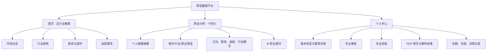
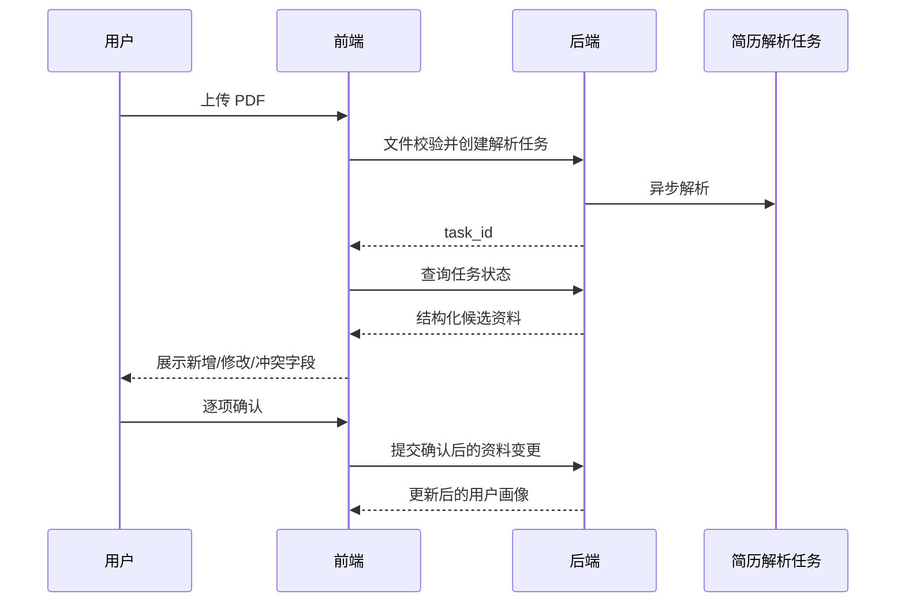
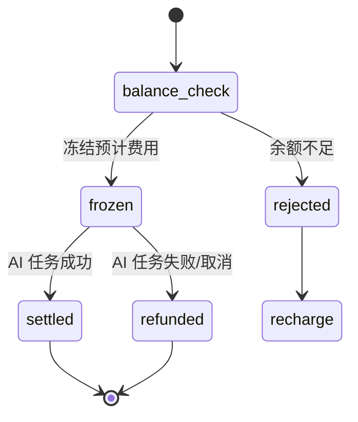

# 前端 V2 需求梳理与原型范围

> 状态：原型需求稿  
> 目标：先确认产品信息架构和交互，再进入 Vue 生产页面重构。

## 1. 产品定位

平台从“多功能招聘工具集合”收敛为一个以真实行业数据和个人职业规划为核心的产品：

- 未登录用户通过首页了解全行业就业市场。
- 登录用户基于学校、专业、课程、技能和简历信息生成个性化职业分析。
- AI 职业分析和 AI 对话是付费能力，每次使用消耗账户余额。
- 用户资料是职业分析的长期数据底座；PDF 简历是资料补全入口，不直接覆盖用户数据。

## 2. 本期页面范围

主导航只保留两个一级页面：

1. 首页：全行业数据分析，公开访问。
2. 职业分析：个性化分析，需要登录，生成 AI 报告或发起 AI 对话时扣费。

用户个人中心通过右上角头像进入，包含：

1. 用户资料。
2. 简历管理与 PDF 解析。
3. 余额和充值记录。
4. AI 消费记录。

职位列表、公司列表、收藏、投递、消息等现有页面不进入本期主导航。是否删除后端能力不在原型阶段决定。

## 3. 用户角色与访问权限

| 能力 | 游客 | 登录用户 |
|---|---:|---:|
| 查看首页行业大盘 | 可用 | 可用 |
| 使用首页筛选 | 可用 | 可用 |
| 查看职业分析入口说明 | 可用 | 可用 |
| 查看个性化职业分析 | 不可用，点击后登录 | 可用 |
| 修改个人资料 | 不可用 | 可用 |
| 上传和解析简历 | 不可用 | 可用 |
| AI 职业分析/对话 | 不可用 | 余额充足时可用 |
| 充值和查看消费记录 | 不可用 | 可用 |

公共首页不得因为后台请求、过期 Token 或未登录状态主动弹登录。登录提示只由用户点击受保护功能触发。

## 4. 信息架构

## 5. 首页：全行业数据分析

### 5.1 页面目标

让未登录用户在 30 秒内理解当前就业市场的规模、趋势、薪资和技能需求，并自然进入个性化职业分析。

### 5.2 页面模块

1. 顶部筛选：时间范围、城市、行业、学历和经验。
2. 核心指标：招聘岗位量、平均薪资、热门行业、需求增长率。
3. 行业需求趋势：展示行业岗位数量随时间变化。
4. 城市薪资对比：展示重点城市中位薪资和岗位量。
5. 热门技能：展示技能需求占比和趋势。
6. 行业机会榜：岗位增长、薪资、人才缺口综合排序。
7. 薪资分布：展示主要月薪区间、P50 和 P75。
8. 人才结构：展示学历要求和工作经验构成。
9. 城市机会矩阵：对比城市薪资水平与岗位增长率。
10. 月度变化信号：展示需求加速、薪资上涨、新兴技能和降温方向。
11. 个性化 CTA：提示“完善资料，生成我的职业分析”。

### 5.3 状态

- 正常数据。
- 无筛选结果。
- 数据加载。
- 数据源降级：Elasticsearch 关闭时展示 PostgreSQL 数据，并标记数据更新时间，不向普通用户暴露技术错误。

## 6. 职业分析

### 6.1 页面目标

根据用户资料与市场数据回答四个问题：

1. 我适合哪些职业方向？
2. 哪些城市更适合我？
3. 我的能力与市场要求差多少？
4. 下一步应该学习或行动什么？

### 6.2 分析输入

- 用户学校、学历、专业和毕业时间。
- 专业课程及课程掌握程度。
- 已确认的专业技能和熟练度。
- 项目、实习和工作经历。
- 意向城市、行业、薪资和职业方向。
- PDF 简历解析后经用户确认的数据。
- 页面临时筛选：城市、行业、职业方向、经验要求。

### 6.3 分析结果

- 个人画像完整度和本次分析依据。
- 推荐职业方向 Top 3，包括匹配度、理由和证据。
- 城市机会对比：岗位量、薪资、竞争度、增长率。
- 技能差距雷达：用户已有能力与市场目标能力。
- 推荐课程和技能补全清单。
- 30/60/90 天行动计划。
- 真实市场证据摘要和数据更新时间。
- AI 职业顾问对话入口。

### 6.4 扣费交互

- 普通筛选和查看已有报告不扣费。
- 点击“生成/重新生成 AI 分析”前展示本次费用和当前余额。
- 点击“发送 AI 对话”前在输入区展示单次预计费用。
- 余额不足时不发起任务，打开充值弹窗。
- 后端创建成功后再扣费；幂等重试不能重复扣费。
- 失败或系统取消的任务应自动退回冻结金额。

原型暂用示例价格：职业分析 ¥2.00/次，AI 对话 ¥0.20/次。正式价格必须由后端产品配置返回，前端不得硬编码。

## 7. 用户资料

### 7.1 基本信息

- 姓名、头像、性别、出生年份。
- 手机号、邮箱、所在城市。
- 求职状态、期望毕业时间。

### 7.2 教育与专业

- 学校名称、学校层次、学历。
- 专业名称、专业类别、入学/毕业时间。
- GPA/成绩排名（可选）。
- 目标行业、目标岗位、意向城市、期望薪资。

### 7.3 专业课程

每门课程包含：课程名、分类、成绩或掌握程度、是否核心课程、来源（手动/简历解析）。课程支持批量添加、删除和确认。

### 7.4 专业技能

每项技能包含：技能名、类别、熟练度、使用年限、证据（课程/项目/实习）、来源和用户确认状态。

### 7.5 完整度

个人中心和职业分析页都展示画像完整度。完整度低时明确提示缺失字段及其对分析准确度的影响。

## 8. PDF 简历上传与资料更新

规则：

- 仅接受 PDF；限制大小由后端返回，原型展示 10MB。
- 解析结果必须先预览，不能静默覆盖现有资料。
- 对学校、专业、联系方式等冲突字段显示“原值 → 新值”。
- 用户可以按模块或按字段接受/拒绝。
- 保存原始简历、解析版本、更新时间和解析状态。
- 简历解析是否收费待确认；原型暂按免费资料补全能力处理。

## 9. 钱包和计费

### 9.1 页面信息

- 可用余额、冻结金额、本月 AI 消费。
- 快捷充值金额和自定义金额。
- 充值订单状态。
- 消费记录：时间、功能、关联任务、金额、结果。
- 退款/退回记录。

### 9.2 计费模型建议

采用“预冻结 + 完成结算”流程：

## 10. 原型视觉方向

- 风格：可信、克制、数据化，不采用过度拟人化的机器人视觉。
- 主色：深海军蓝 + 青绿色，用于表达数据可信度和增长。
- 页面骨架：顶部全局导航；大面积浅灰背景；白色数据卡片。
- 图表：少装饰、明确单位、支持 hover 和筛选联动。
- 个人分析：用匹配度、证据和行动项建立信息层级。
- 移动端：顶部导航折叠；数据卡单列；筛选改为横向滚动或抽屉。

## 11. 原型阶段暂定假设

以下内容为了形成可操作原型先使用默认方案，开发前需要产品确认：

1. 职业分析和 AI 对话采用余额扣费，单价由后端产品配置管理。
2. PDF 解析本期不扣费，但 AI 生成职业报告扣费。
3. 简历解析结果必须由用户确认后才写入资料。
4. 首页全部公开；职业分析页面允许游客看到说明，但生成和个人结果需要登录。
5. 首页提供面向公开市场数据的“AI 行业问数”，职业分析页提供基于个人资料和报告上下文的 AI 职业顾问；两者都不作为独立一级导航。
6. 本期不把职位、公司、收藏、投递和消息放入主导航。

## 12. 验收标准

- 首页在无 Token、过期 Token 和 ES 关闭情况下均可展示。
- 用户只有点击受保护能力时才看到登录入口。
- 职业分析清楚展示分析输入、市场证据、费用和结果。
- 个人资料覆盖学校、专业、课程、技能和意向。
- 简历上传包含解析进度、差异预览和用户确认。
- 钱包展示余额、充值和每次 AI 消费。
- 桌面端和移动端均可完成主要原型流程。
