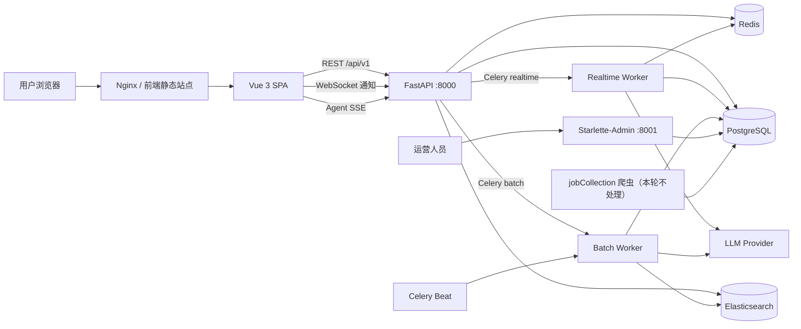
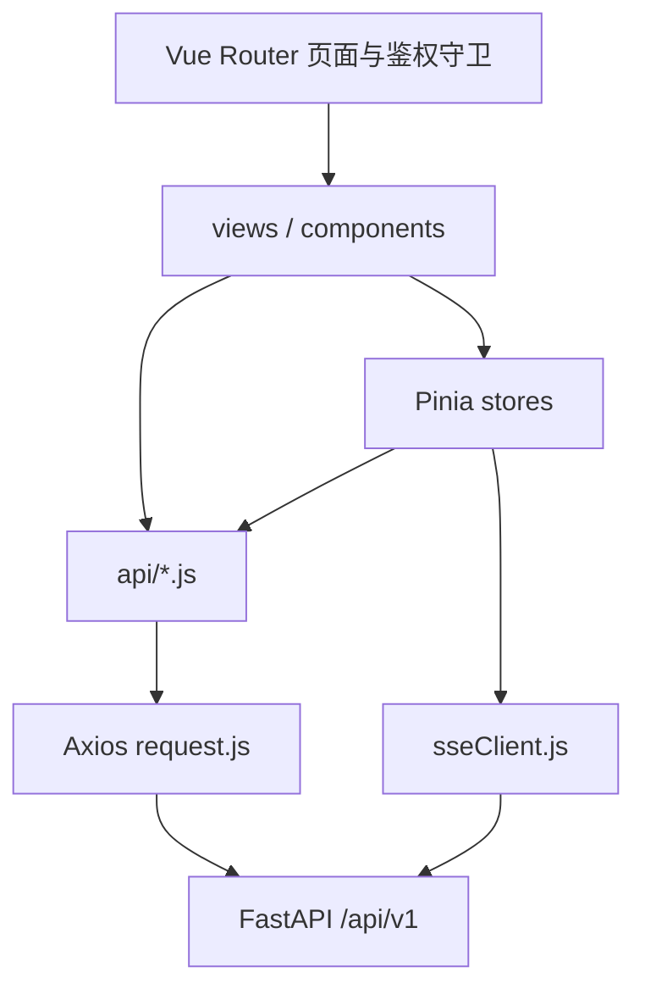
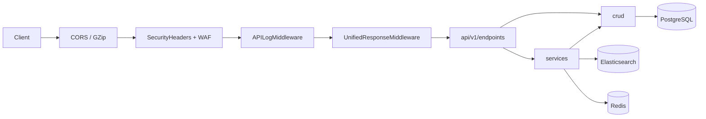
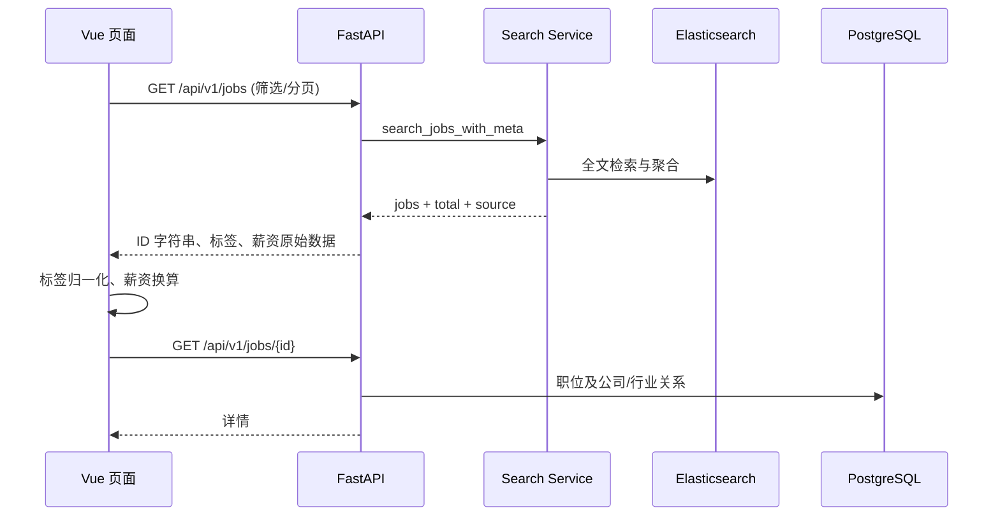
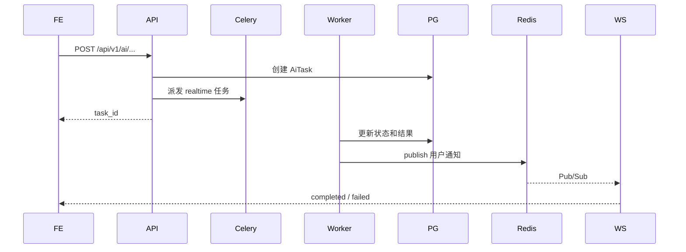

# 项目整体架构

> 适用代码基线：2026-07-28 工作区  
> 本文描述当前代码实际实现。爬虫仅作为上游数据来源说明，本轮未审计或修改其内部逻辑。

## 1. 系统定位

本项目是一个面向求职者、大学生和职业规划场景的招聘数据平台。系统把职位与公司数据沉淀到 PostgreSQL 和 Elasticsearch，对外提供职位检索、市场分析、专业分析、简历、收藏、投递、消息、钱包支付、传统 AI 任务和职业规划 Agent 等能力。

核心运行形态不是单体进程，而是一个共享代码库中的多个服务：

- Vue 3 单页前端负责用户交互、图表和实时状态展示。
- FastAPI 提供 `/api/v1` REST API、WebSocket 和 Agent SSE。
- Celery realtime worker 执行用户交互型 AI/Agent 任务。
- Celery batch worker 执行解析、同步和批处理任务。
- Starlette-Admin 提供独立运营后台。
- PostgreSQL 保存权威业务数据；Elasticsearch 承担职位搜索和聚合；Redis 承担缓存、队列、锁、限流、Pub/Sub 和 Streams。

## 2. 系统上下文



## 3. 代码库分区

| 路径 | 职责 |
|---|---|
| `frontend/` | Vue 3、Vue Router、Pinia、Axios、ECharts、Element Plus |
| `jobCollectionWebApi/api/v1/endpoints/` | FastAPI 路由、鉴权、输入输出和 HTTP 语义 |
| `jobCollectionWebApi/services/` | 搜索、分析、AI、支付外围能力的业务编排 |
| `jobCollectionWebApi/crud/` | SQLAlchemy 数据访问与原子状态迁移 |
| `jobCollectionWebApi/schemas/` | Pydantic 请求与响应契约 |
| `jobCollectionWebApi/tasks/` | Celery realtime/batch 任务入口 |
| `jobCollectionWebApi/agent/` | Agent Runtime、状态、工具、事件、SSE 和锁 |
| `jobCollectionWebApi/core/` | 配置、缓存、Celery、指标、异常、日志、熔断器 |
| `jobCollectionWebApi/middleware/` | 统一响应、API 日志、安全响应头和 WAF |
| `common/databases/models/` | 跨 API、任务和管理后台共享的 SQLAlchemy 模型 |
| `common/databases/` | PostgreSQL、Redis、MySQL 连接管理 |
| `alembic/` | 数据库迁移；容器启动时先执行 `alembic upgrade head` |
| `jobCollection/` | 上游招聘数据采集，本轮不修改 |
| `deploy/`、`docker-compose.yml` | Nginx、容器和生产拓扑 |
| `prometheus.yml`、`grafana/` | 指标采集和可视化看板 |
| `tests/`、`frontend/src/**/*.test.js` | 当前维护中的后端与前端测试 |

## 4. 前端架构

### 4.1 分层



- `views/` 负责路由级页面；`components/` 负责 Agent、图表、首页和登录等可复用界面。
- `stores/` 保存认证、简历、收藏、传统 AI 任务和 Agent 会话状态。
- `api/` 是后端路径的唯一调用适配层，页面不应自行拼接 API 根地址。
- `request.js` 自动附加 Bearer Token，解包 `{code, msg, data}` 成功响应，并在 401 时串行刷新 Token 后重试。
- Agent 实时流不使用浏览器原生 `EventSource`，而是使用 `fetch`，以便附加 Authorization 和 `Last-Event-ID`。

### 4.2 路由域

- 公共：主页、职业数据、职位列表/详情、公司列表/详情、专业分析、城市/行业对比。
- 登录后：Agent 工作台、简历、收藏、投递、消息、钱包。
- Agent 有 `/agent` 与 `/agent/:conversationId` 两个入口；前端开关明确为 `false` 时路由回到主页，最终可用性仍以后端 `/agent/capabilities` 为准。

### 4.3 前后端契约约束

- API 根路径为 `/api/v1`；开发环境由 Vite `/api` 代理到 `127.0.0.1:8000`。
- Snowflake/BigInteger ID 在响应中序列化为字符串，避免 JavaScript 超过 `Number.MAX_SAFE_INTEGER` 后精度丢失。
- 职位 `tags` 同时兼容 JSONB 数组和历史 JSON 字符串，由 `jobData.js` 统一归一化。
- 数据库存储薪资单位为元；前端展示层统一换算为 `K`，不得直接给原始数值追加 `K`。
- 前端调用使用后端真实路径，例如 `/applications`、`/companies`、`/upload`；不依赖 307/308 尾斜杠重定向。

## 5. 后端架构

### 5.1 请求链



`get_db` 为普通请求提供 AsyncSession：成功请求自动提交，异常自动回滚。SSE 使用短生命周期鉴权依赖，先验证用户再释放数据库会话，避免长连接长期占用连接池。

### 5.2 API 领域

| 前缀 | 主要能力 |
|---|---|
| `/auth`、`/users` | 注册登录、Token 刷新/退出、个人资料、用户管理 |
| `/jobs`、`/companies`、`/skills` | 职位检索与详情、公司、技能频率 |
| `/industries`、`/cities`、`/city_hots` | 行业和地域字典 |
| `/analysis` | 市场统计、技能云、城市/行业对比、专业分析 |
| `/resumes`、`/upload` | 结构化简历及文件上传 |
| `/favorites`、`/applications`、`/messages` | 收藏/关注、投递记录、站内消息 |
| `/ai` | 传统异步 AI 建议、职业罗盘、简历解析、任务历史 |
| `/agent` | 会话式职业规划 Agent；详见 `AGENT_ARCHITECTURE.md` |
| `/payment`、`/wallet` | 支付订单、回调、退款、余额和交易流水 |
| `/ws` | AI 任务完成/失败的用户级 WebSocket 通知 |

### 5.3 数据职责

| 存储 | 权威职责 |
|---|---|
| PostgreSQL | 用户、职位、公司、行业、简历、收藏、投递、支付、AI 任务、Agent 会话与运行状态 |
| Elasticsearch | 职位全文检索、筛选、统计聚合、城市/行业对比 |
| Redis | API 缓存、速率限制、分布式锁、Celery broker/result、WebSocket Pub/Sub、Agent Redis Streams |
| 本地/挂载目录 | 上传文件与静态资源，生产环境由 Nginx `/static/` 暴露 |

PostgreSQL 是事务状态的最终事实来源。Redis 事件或锁不可用时，Agent 仍以数据库 claim 和状态为最终裁决；Elasticsearch 不可用时，部分统计工具可降级到 PostgreSQL，比较类工具当前不能降级。

### 5.4 Elasticsearch 功能开关

Elasticsearch 默认关闭，由后端环境变量统一控制：

```ini
ES_ENABLED=false
```

- `false`：应用启动和周期健康探测不会建立 ES 连接；`/health` 返回 `elasticsearch: disabled`；ES 同步任务直接返回 `disabled`；支持降级的搜索与分析链路使用 PostgreSQL。
- `true`：启动时连接 ES 并确保职位索引存在，搜索、聚合和同步任务才会使用 ES。
- 开启时仍需配置 `ES_HOST`、`ES_PORT`、`ES_SCHEME`、`ES_USER`、`ES_PASSWORD` 和 `ES_INDEX_JOB`。

## 6. 异步与实时通道

系统存在两套不同的 AI 运行模型，不能混为一谈：

1. 传统 AI 任务：API 创建 `AiTask`，Celery 执行，前端轮询 `/ai/task/{task_id}`，并可通过 Redis Pub/Sub → WebSocket 接收完成通知。
2. Agent 运行：API 创建或恢复 `AgentRun`，realtime worker 执行有界 Runtime，事件写入 Redis Streams，前端通过 SSE 回放和跟随事件。

Celery 路由将 `tasks.agent_tasks.*` 放入 `realtime` 队列；批量解析、ES 同步等任务进入 `batch` 队列。这样可避免离线任务挤占面向用户的交互任务。

## 7. 主要业务链路

### 7.1 职位浏览



### 7.2 AI 任务通知



## 8. 安全、可靠性与可观测性

- JWT Bearer 鉴权；刷新 Token 失败时清理认证和 Pinia 敏感状态。
- WAF、安全响应头、CORS、统一异常和统一响应中间件。
- Redis Lua 用于原子限流/锁操作；支付回调使用订单状态和锁保证幂等。
- LLM 调用受超时、最大输出、重试和熔断器约束。
- `/metrics` 暴露 HTTP、基础设施、AI、Celery、支付和 Agent 指标。
- 应用生命周期每 15 秒探测 PostgreSQL、Elasticsearch 和 AI 熔断器状态。
- Grafana 使用仓库预置 dashboard；Nginx 对 SSE 必须关闭代理缓冲并提高读取超时。

## 9. 部署拓扑

`docker-compose.yml` 的启动顺序为：PostgreSQL/Redis/Elasticsearch 健康 → Alembic migration 完成 → API/Admin/Workers → Beat/Frontend/Monitoring。

生产容器包括：

- `db`、`redis`、`elasticsearch`
- 一次性 `migration`
- `api`、`admin`
- `worker_realtime`、`worker_batch`、`beat`
- `frontend`（Nginx 静态站点和反向代理）
- `prometheus`、`grafana`

基础设施端口默认只绑定 `127.0.0.1`；用户入口由前端/Nginx 的 8080 或正式 80/443 提供。

## 10. 当前边界和维护约束

- `jobCollection/` 是上游采集系统，本轮不修复；业务 API 与 Agent 只消费已经落库/入 ES 的数据。
- Agent 对话和结果来自真实后端；工作台上的方向卡片、周计划、机会卡等 dashboard 模块当前仍使用 mock 数据，代码中 `isDashboardMock` 固定为 `true`。
- 当前维护测试集中在 `tests/`；历史 `pytest/` 套件依赖额外测试环境，不能替代现有回归。
- 新增接口或字段时，应同时更新 Pydantic Schema、前端 `api/` 封装和契约测试。
- 修改数据库模型必须提供 Alembic 迁移，禁止仅依赖运行时 `create_all`。

## 11. 验证基线

本次集成后的基线验证：

- 后端维护测试：46 项通过。
- 前端 Vitest：27 项通过。
- Vite 生产构建：1608 个模块成功构建。
- Docker Compose：使用非敏感占位必填变量成功完成配置解析。
- Python 源码 AST 与 Vue SFC 编译检查通过。
