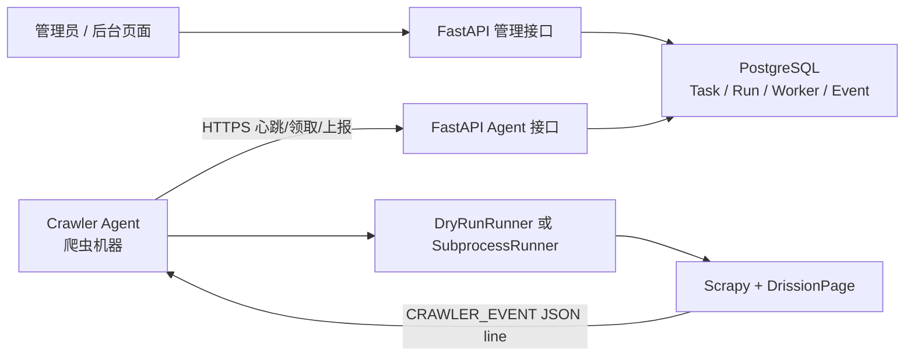

# 爬虫控制与监控架构

## 1. 目标与当前边界

这套架构把“控制面”和“执行面”分开：

- FastAPI、PostgreSQL 和管理后台属于控制面，运行在后端服务器。
- `crawler_agent.py`、Scrapy、DrissionPage 和 Chrome 属于执行面，运行在实际爬虫机器。
- 爬虫机器只需主动访问后端 HTTPS，不要求后端能够访问爬虫机器，也不依赖跨机器 PID。
- 当前缺少有效 Boss Cookie，因此必须保持 `CRAWLER_AGENT_DRY_RUN=true`。dry-run 不会打开 Chrome、不会启动 Scrapy、不会访问 Boss，但可以完整测试任务启动、暂停、恢复、停止、心跳、进度、事件与僵死判定接口。

后续 Cookie 可用后，只需要在爬虫机器关闭 dry-run，不需要修改后端控制协议或监控页面。

## 2. 组件关系



控制面不会接收任意 shell 命令。管理员只能提交 `start/pause/resume/stop/retry`，Agent 只能启动环境变量白名单里的爬虫名称。

## 3. 持久化模型

### `boss_crawl_task`

保留已有 URL 和筛选配置，并增加：

- `spider_name`：需要运行的白名单爬虫。
- `spider_args`：类型化参数，不是命令行字符串。
- `desired_status`：管理员期望状态。
- `latest_run_id`：最近一次运行。

### `crawler_workers`

每个 Agent 一行，保存：

- Worker ID、名称、主机名和操作系统。
- 支持的爬虫列表、dry-run 能力和遥测版本。
- 最大并发数、当前运行数和最后心跳。

### `crawler_runs`

每次启动或重试产生独立运行，保存：

- 实际状态与期望状态。
- Worker、PID、execution token。
- 指标、恢复断点、开始/心跳/结束时间。
- 退出码与错误原因。

Agent 对 Run 的每次更新必须同时携带 `run_id` 和该次领取生成的 `execution_token`，旧 Agent 或旧进程不能覆盖新运行。

### `crawler_events`

保存状态变化、结构化日志和进度事件。事件只允许有限长度的消息和安全 JSON，不保存 Cookie、Authorization、请求头或响应正文。

## 4. 状态机

| 当前状态 | 命令 | 期望状态 | 下一状态 |
|---|---|---|---|
| 无运行/终态 | start | running | queued |
| starting/running | pause | paused | pausing |
| paused | resume | running | queued |
| queued | stop | stopped | stopped |
| starting/running/paused | stop | stopped | stopping |
| failed/stale/stopped | retry | running | queued |

`desired_status` 表示管理员想要的状态，`status` 表示 Agent 已确认的实际状态。后台不能在 Agent 尚未响应时直接宣称进程已经停止。

## 5. 管理员接口

前缀：`/api/v2/admin/crawlers`，仅 `admin` 和 `super_admin` 可以访问。

| 方法 | 路径 | 用途 |
|---|---|---|
| GET | `/overview` | Worker、运行、任务和累计指标概览 |
| GET | `/workers` | Worker 在线状态与能力 |
| GET | `/tasks` | 任务列表 |
| POST | `/tasks/{taskId}/commands` | start/pause/resume/stop/retry |
| GET | `/runs/{runId}` | 单次运行详情与指标 |
| GET | `/runs/{runId}/events?afterId=` | 增量读取运行事件，预留给轮询或 SSE 页面 |

命令示例：

```json
{
  "action": "start"
}
```

原有 Starlette Admin 中的爬虫任务按钮已经接入同一控制服务，不再直接在 API 服务器调用 `subprocess.Popen()`。

## 6. Agent 接口

前缀：`/api/v2/crawler-agent`，所有请求必须携带：

```text
X-Crawler-Agent-Token: <shared secret>
```

| 方法 | 路径 | 用途 |
|---|---|---|
| POST | `/workers/heartbeat` | 注册/刷新 Worker 和能力 |
| POST | `/runs/claim` | 原子领取 queued Run |
| GET | `/runs/{runId}/desired-state` | 查询暂停/停止命令 |
| POST | `/runs/{runId}/heartbeat` | 上报状态、PID、指标和断点 |
| POST | `/runs/{runId}/events` | 批量上报日志/进度事件 |
| POST | `/runs/{runId}/finish` | 确认 stopped/succeeded/failed |

共享 Token 只认证机器身份；Run 更新还必须通过 execution token。

## 7. 监控指标契约

以下计数保证单次运行内只增不减：

- `itemsScraped`：已产出 Item 数。
- `pagesProcessed`：已完成页面数。
- `responsesReceived`：收到响应数。
- `errors`：错误数。
- `captchaCount`：验证码/风控次数。
- `retries`：重试次数。
- `bytesReceived`：接收字节数。

`metrics` 是可扩展 JSON，因此后续可以增加：

- `jobsInserted`、`jobsUpdated`、`jobsDuplicated`。
- `proxyRotations`、`loginFailures`、`cookieExpiresAt`。
- `requestsPerMinute`、`databaseWritesPerMinute`。
- 各城市、行业和页码的分维度统计。

新增指标不需要数据库迁移，但面向页面展示的核心指标应先进入文档和自动化测试。

## 8. 配置

后端和 Agent 共用以下配置名称：

```dotenv
CRAWLER_AGENT_TOKEN=使用密码生成器创建的长随机值
CRAWLER_AGENT_API_URL=https://your-domain/api/v2
CRAWLER_AGENT_ID=windows-crawler-01
CRAWLER_AGENT_NAME=Boss采集节点01
CRAWLER_AGENT_HEARTBEAT_SECONDS=10
CRAWLER_AGENT_STALE_SECONDS=45
CRAWLER_AGENT_POLL_SECONDS=2
CRAWLER_AGENT_MAX_CONCURRENCY=1
CRAWLER_AGENT_DRY_RUN=true
CRAWLER_AGENT_ALLOWED_SPIDERS=boss_list_drission,boss_detail_drission
CRAWLER_AGENT_REQUEST_TIMEOUT=15
CRAWLER_PROJECT_DIR=D:\Code\job\jobCollection
CRAWLER_PYTHON_EXECUTABLE=D:\miniconda\envs\job\python.exe
CRAWLER_TELEMETRY_EVERY=10
```

安全要求：

- 服务器未配置 `CRAWLER_AGENT_TOKEN` 时，Agent API 返回 503。
- Token 不得写入 Git、日志、事件或后台页面。
- 白名单不得包含用户输入或任意模块路径。
- 没有 Cookie 时必须保持 dry-run。

## 9. 启动与验证

### 数据库迁移

```bash
alembic upgrade 20260805_00
```

现有生产库应先确认当前版本为 `20260728_02`，再升级到 `20260805_00`。本次迁移已按该区间完成离线 SQL 和临时 PostgreSQL 验证。项目旧基线 `20260201_00` 在“全新空数据库”路径仍存在表创建顺序问题，因此不要把空库安装与本次线上增量迁移混为同一步；空库基线需要单独修复后再作为新环境初始化方案。

### dry-run Agent

在爬虫机器设置环境变量后：

```bash
python -m jobCollection.crawler_agent
```

验收顺序：

1. 后台看到 Worker online，能力中 `dryRun=true`。
2. 对一条任务发送 start，产生 queued Run。
3. Agent 领取后 Run 进入 running，模拟指标持续增长。
4. 发送 pause，Run 进入 paused 并保存 `dryRunTick` 断点。
5. 发送 resume，Agent 使用新 execution token 重新领取。
6. 发送 stop，Run 最终进入 stopped。
7. 事件列表包含 started、paused、stopped 和进度事件。

### Supervisor 示例（Agent 位于 Linux 爬虫节点时）

```ini
[program:job-crawler-agent]
directory=/opt/job
command=/opt/job/jobCollectionWebApi/venv/bin/python -m jobCollection.crawler_agent
environment=PYTHONPATH="/opt/job",CRAWLER_AGENT_DRY_RUN="true"
autostart=true
autorestart=true
stopasgroup=true
killasgroup=true
stdout_logfile=/var/log/supervisor/job-crawler-agent.log
stderr_logfile=/var/log/supervisor/job-crawler-agent-error.log
```

Windows 节点可使用 NSSM、任务计划程序或 Windows Service Wrapper 托管相同入口。

## 10. 切换到真实抓取

满足以下条件后才能把 `CRAWLER_AGENT_DRY_RUN` 改为 `false`：

1. Cookie/账号文件已在爬虫机器本地配置，未上传后端。
2. Scrapy 白名单和参数已验证。
3. Chrome/DrissionPage 能由 Agent 所在用户启动。
4. 暂停和停止能结束整个进程组，无残留 Chrome。
5. 遥测中不包含 Cookie、Token、手机号或响应正文。
6. 单节点最大并发仍为 1，确认风控策略后再提高。

真实模式下 Agent 构造的命令固定为：

```text
python -m scrapy crawl <allowlisted spider> -a task_id=<id> -a task_url=<url>
```

它不会执行数据库中的原始 shell 字符串。
